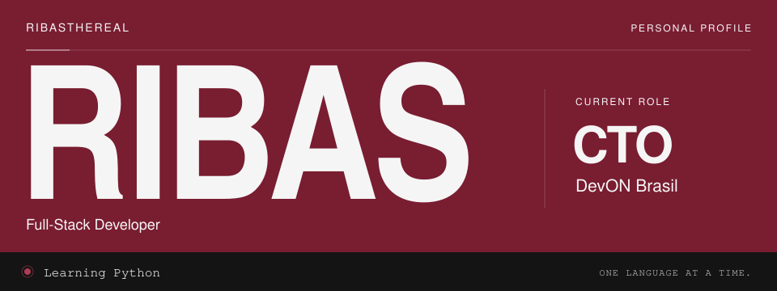
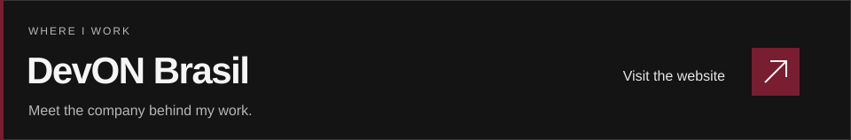

<picture>
  <source media="(max-width: 600px) and (prefers-reduced-motion: reduce)" srcset="./assets/ribas-vinho-mobile.svg">
  <source media="(max-width: 600px)" srcset="./assets/ribas-vinho-mobile.gif">
  <source media="(prefers-reduced-motion: reduce)" srcset="./assets/ribas-vinho.svg">
  
</picture>

 

I'm **Ribas**, CTO at **DevON Brasil**. I'm at the beginning of my Python journey, learning the basics before moving on to other languages.

This is where I'll share what I'm learning along the way.

 

<a href="https://devonbrasil.pages.dev/">
  <picture>
    <source media="(max-width: 600px)" srcset="./assets/devon-vinho-mobile.svg">
    
  </picture>
</a>

  
  &nbsp;
  

A little more about what I'm learning

For now, I'm keeping it simple: understand the basics, practice, and get comfortable with Python. I'll explore other languages as I get further along.

